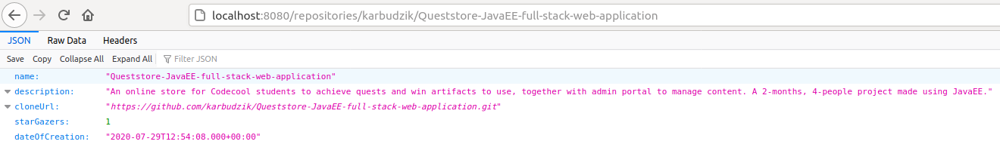

# Spring-exercise-1-GitHub-repository-API
A simple service using GitHub's API to get details of any given repository based on creator's name and the name of repository.

## General information

Details of the repository include:

* full name of repository
* description of repository
* git clone url
* number of stargazers
* date of creation (ISO format)

The API of the service looks as follows: GET /repositories/{owner}/{repository-name} { "fullName": "...", "description": "...", "cloneUrl": "...", "stars": 0, "createdAt": "..." }

## Project status 
Simple project created during workshops as an introduction to REST in Spring.

Project is finished.